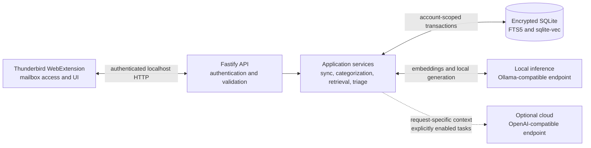

# AI MailPilot

AI MailPilot is a local-first email intelligence system for Thunderbird. It indexes a user's
mailbox on their device, organizes messages into reviewable semantic categories, builds a daily
priority view, and answers grounded questions over email and supported attachments.

The product consists of a Thunderbird extension and a local Node.js service. Thunderbird remains
the source of mailbox data and the only component with mailbox permissions. The Core service owns
AI orchestration, retrieval, and encrypted persistence.

## Capabilities

### Mailbox indexing

- Synchronizes selected Thunderbird accounts and folders without storing mailbox passwords in Core.
- Extracts text from PDF, DOCX, HTML, JSON, XML, CSV, Markdown, logs, and plain-text attachments.
- Creates multilingual 1024-dimensional `bge-m3` embeddings locally and stores them with an FTS5
  lexical index.
- Captures existing Thunderbird tags and meaningful folder names as user-owned organization signals.

### Categorization and taxonomy maintenance

- **Organize (fast):** assigns only a clear nearest-prototype match; ambiguous mail remains
  uncategorized.
- **Refine (accurate AI):** shortlists existing categories, asks the configured generation model
  only when needed, and validates the proposal with deterministic rank, margin, and text-evidence
  checks.
- Supports multiple labels while capping speculative automatic assignments.
- Preserves user-confirmed labels across automatic reruns and learns category prototypes from
  corrections.
- Clusters residual mail on-device to propose new categories. New, merge, split, and retire
  operations enter a review queue and change the taxonomy only after explicit approval.
- Can mirror AI categories to namespaced Thunderbird tags or prepare a reversible folder-move plan.

### Priority and calendar

- Builds **Today's Focus**, **Last 7 days**, and **All** views for messages that need action,
  important updates, summaries, and low-priority mail.
- Preserves Done, Snooze, and Dismiss decisions and carries unresolved actionable mail forward.
- Extracts dated meetings, appointments, and deadlines during triage, exposes them to chat, and can
  export an event as an `.ics` file.

### Grounded mailbox assistance

- Uses hybrid FTS5 and vector retrieval, reciprocal-rank fusion, date and sender constraints,
  conversation memory, and optional reranking.
- Retrieves from message bodies, extracted attachment chunks, and captured calendar events.
- Streams answers with clickable source messages and attachment filenames.
- Summarizes an opened message and its indexed attachments, identifies actions, replies, and
  deadlines, and generates an editable reply draft. AI MailPilot never sends a generated draft
  automatically.

## Privacy Model

Local processing is the default:

- Mailbox text, extracted attachment text, full-text indexes, embeddings, categories, conversation
  state, and assistant caches are stored in one SQLCipher-encrypted SQLite database.
- Embeddings are always generated through the local `main` endpoint. The database, vector index,
  and embedding corpus are not uploaded to a cloud provider.
- The localhost API requires a bearer token obtained through a short-lived, single-use pairing code.
- Database and configuration files are created in platform-specific application-data directories
  with owner-only permissions where the operating system supports them.

Cloud generation is optional. If a cloud chat provider is configured, chat can send the prompt and
request-specific email or attachment context to that provider. The opened-message assistant requires
an additional cloud confirmation before generating a summary or draft. Refine and Priority each have
a separate cloud toggle. Discovery additionally requires both the global cloud-discovery option and
per-account discovery consent. These cloud choices are not enabled by default.

The local database key is stored separately from the database in the application's configuration
directory. This protects a copied database file, but it does not protect against an attacker who can
read both files under the same operating-system account. See the [implementation status and security
notes](docs/PROJECT_PLAN.md#security-boundaries) for the exact boundary.

## Architecture



The runtime is deliberately split at the mailbox boundary: the extension reads and modifies
Thunderbird state, while Core has no active IMAP client and stores no mailbox credentials.

## Requirements

- [Node.js](https://nodejs.org/) 20 or 22
- [Thunderbird](https://www.thunderbird.net/) 115 or later
- [Ollama](https://ollama.com/) or another OpenAI-compatible local endpoint
- `bge-m3` or another embedding model that returns exactly 1024 dimensions
- A local generation model; the default configuration names `llama3.1`

Python is optional. It is required only for the experimental cross-encoder reranker and the
standalone clustering evaluation under [`ml/`](ml/README.md).

## Quick Start

### 1. Install dependencies and models

```bash
git clone https://github.com/muhammadnoorulainroy/ai-mailpilot.git
cd ai-mailpilot
npm install

ollama pull bge-m3
ollama pull llama3.1
```

Start Ollama before starting Core. If a different generation model is selected in Settings, pull
that model as well.

### 2. Start Core

```bash
npm run dev:core
```

Core listens on `http://localhost:3420`. On startup it prints a six-digit pairing code that is valid
for 15 minutes and can be used once.

### 3. Build and load the extension

```bash
npm run build -w @ai-mailpilot/extension
```

In Thunderbird:

1. Open **Settings > Add-ons and Themes**.
2. Open **Debug Add-ons** or navigate to `about:debugging#/runtime/this-thunderbird`.
3. Choose **Load Temporary Add-on**.
4. Select `packages/extension/dist/manifest.json`.
5. Open AI MailPilot Settings and enter the pairing code shown by Core.
6. Select the accounts AI MailPilot may index, verify the model configuration, and run **Sync inbox
   now**.

For a local XPI artifact:

```bash
npm run build -w @ai-mailpilot/extension
npm run package -w @ai-mailpilot/extension
```

The packaged file is `packages/extension/ai-mailpilot.xpi`.

## Model Configuration

All model choices are editable in the extension Settings page.

| Role | Default or preset | Constraint |
| --- | --- | --- |
| Embeddings | `bge-m3` | Must return 1024 dimensions; always local |
| Default generation | `llama3.1` | Used when no separate local chat model is selected |
| Lightweight preset | `qwen3:4b` | Intended for lower-memory local machines |
| Recommended preset | `qwen3:8b` | Stronger structured output and multilingual behavior |
| Institutional preset | `mistral:7b` | Alternative with strong French support |
| Maximum-quality preset | `qwen3:14b` | Requires more memory |

The settings UI can also configure an OpenAI-compatible cloud chat endpoint. Embedding dimensions
are fixed by the current database schema; changing to a model with a different dimension requires a
schema and re-embedding migration.

## Development

This repository is an npm-workspaces monorepo.

```text
ai-mailpilot/
|-- packages/shared/     Shared API contracts, configuration types, and constants
|-- packages/core/       Fastify service, repositories, AI pipelines, and encrypted storage
|-- packages/extension/  Thunderbird WebExtension and user interfaces
|-- ml/                  Optional Python clustering and reranking experiments
|-- docs/                Current implementation status and competitive analysis
`-- .github/workflows/   Node 20/22 continuous integration
```

Useful commands:

| Command | Purpose |
| --- | --- |
| `npm run dev:core` | Start Core in watch mode |
| `npm run dev:extension` | Rebuild the extension on source changes |
| `npm run typecheck` | Type-check all workspaces |
| `npm run lint` | Run ESLint over shipped TypeScript |
| `npm run format:check` | Check source formatting |
| `npm test` | Run workspace test suites |
| `npm run build` | Build all workspaces |

Before opening a pull request, run:

```bash
npm run typecheck
npm run lint
npm run format:check
npm test
npm run build
```

## Current Limitations

- Categorization and priority thresholds are engineering defaults, not results from a public
  labelled benchmark or user study.
- Local inference latency and structured-output reliability depend on the selected model and
  hardware. Long-running jobs expose progress and retry failures but cannot make a slow model fast.
- Attachment extraction does not perform OCR and does not parse legacy Office files, spreadsheets,
  presentations, images, audio, or encrypted PDFs.
- Calendar integration exports `.ics` files; it does not write directly to a calendar provider.
- Existing Thunderbird labels are captured and suggested as discovery hints, but there is no
  one-click import that converts selected labels into AI categories.
- Multi-prototype categories, cluster-representative initial discovery, cross-encoder reranking, and
  LLM query understanding are experimental and disabled by default.
- Federated learning, an MCP server, and an institutional deployment control plane are not
  implemented.

## Documentation

- [Implementation status, architecture, and roadmap](docs/PROJECT_PLAN.md)
- [Competitive analysis](docs/COMPETITIVE_ANALYSIS.md)
- [Contribution guide](CONTRIBUTING.md)
- [Optional Python tools](ml/README.md)

## Contributing

Read [CONTRIBUTING.md](CONTRIBUTING.md) before submitting a change. Please include focused tests for
behavioral changes and preserve the local-first defaults and user-approval boundaries.

## License

AI MailPilot is available under the [MIT License](LICENSE).
